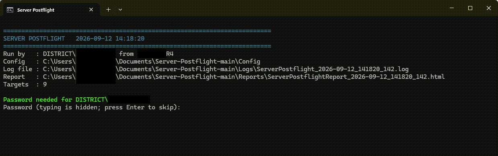
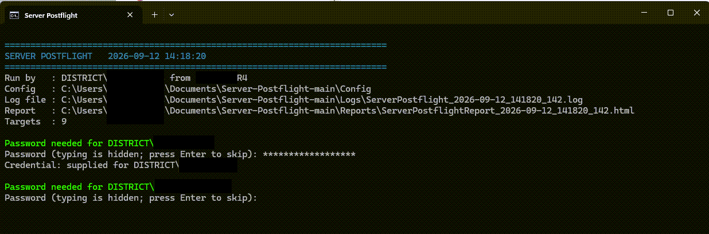
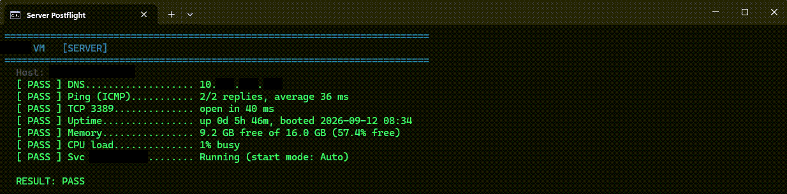
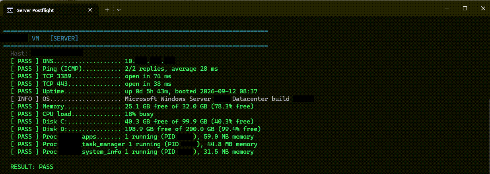
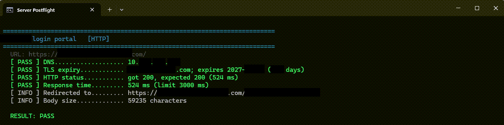
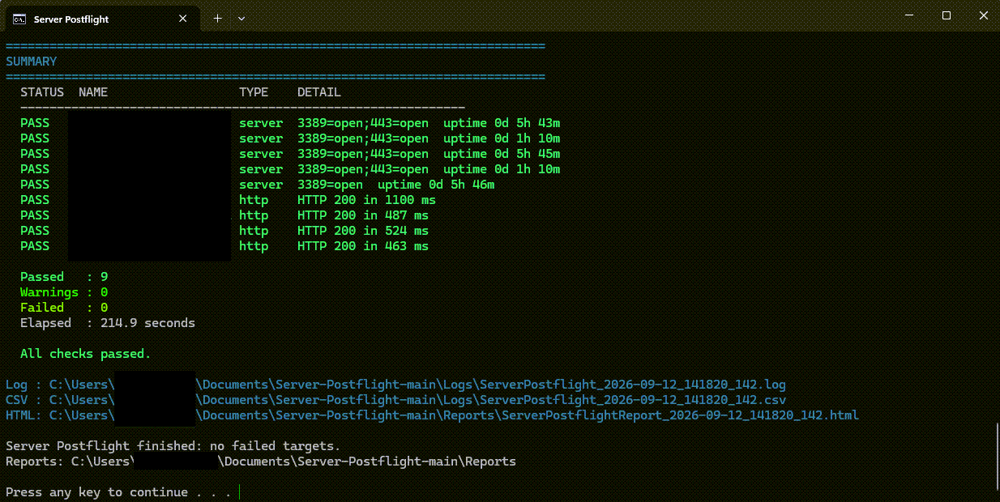
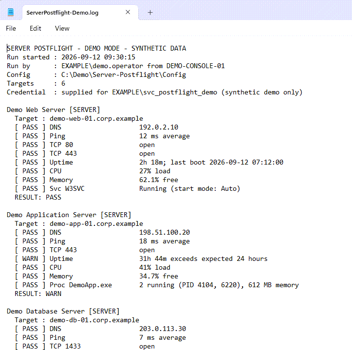
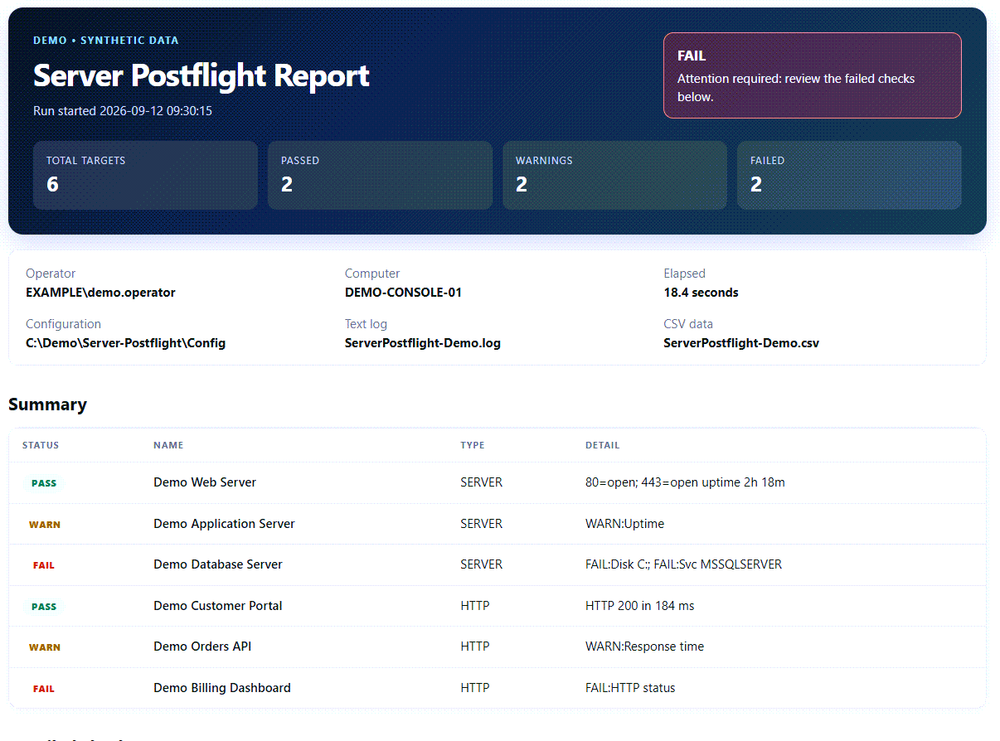
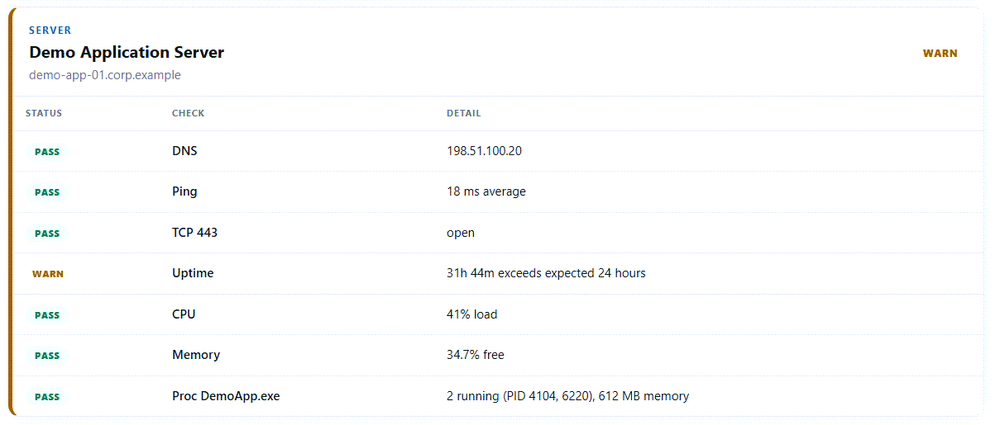

# Server Postflight

Server Postflight is a read-only Windows health-check application for Windows
servers, websites, and HTTP APIs. Define targets in JSON, double-click the
launcher, and review color-coded results in the console, a text log, CSV data,
and a self-contained HTML report.

- **Windows servers:** DNS, ping, TCP ports, uptime, operating system, CPU,
  memory, fixed disks, services, and processes.
- **Web endpoints:** DNS, TLS certificate expiration, HTTP status, response
  time, redirects, response size, and optional content matching.
- **Simple operation:** no installer, command-line arguments, or third-party
  PowerShell modules are required.
- **Read-only checks:** the application does not restart services, stop
  processes, change settings, or modify a target.

[Download the latest release](https://github.com/KevinTLucas/Server-Postflight/releases/latest)

## Quick start

### Requirements

- Windows PowerShell 5.1.
- Network access to the targets you configure.
- CIM/WMI permissions when requesting remote Windows information, services,
  or processes.

### Setup and run

1. Download and extract the latest `Server-Postflight.zip` release.
2. Keep the extracted folder together; its launcher, script, and `Config`
   folder use relative paths.
3. Add at least one target to `Config\ServerChecks.json` or
   `Config\WebChecks.json`.
4. Use the complete files in `Config\Examples` as references.
5. Double-click **Run Server Postflight.cmd**.
6. Enter a password if prompted, or press Enter to use the current Windows
   account.
7. Review the `SUMMARY`, then open the newest report in `Reports`.

Run the CMD launcher rather than opening `ServerPostflight.ps1` directly. The
launcher starts PowerShell correctly, reports whether checks failed, and keeps
the window open so you can read the result.

## Configure

Server Postflight reads three JSON files from `Config`:

| File | Purpose |
| --- | --- |
| `ServerChecks.json` | Windows server targets and their connectivity, system, service, and process checks. |
| `WebChecks.json` | Website and HTTP API targets. |
| `Settings.json` | Output locations, timeouts, defaults, thresholds, and optional behavior. |

The starter server and web files contain empty lists. At least one check must
exist across the two files before the application can run. Files in
`Config\Examples` are references only and are not loaded.

### JSON basics

- Property names and text values use double quotes.
- Numbers and `true` or `false` do not use quotes.
- Separate objects and list items with commas; do not add a comma after the
  final item.
- Use square brackets for lists, such as `[80, 443]`.
- Escape the backslash in Windows account names, such as
  `"EXAMPLE\\healthcheck"`.
- Properties named `_comment` or beginning with `_comment_` are ignored and
  can be used for notes. Other unknown properties cause a configuration error.

The application validates all configuration files before contacting any
target. An error identifies the file, entry, and property that needs attention.

### Windows server checks

Add objects to the `ServerChecks` list:

```json
{
  "ServerChecks": [
    {
      "Name": "Application Server",
      "Host": "app-01.example",
      "Port": [3389, 443],
      "User": "EXAMPLE\\healthcheck",
      "Info": "all",
      "Services": ["W3SVC"],
      "Processes": ["ExampleApp.exe"]
    }
  ]
}
```

| Property | Required | Value | Purpose |
| --- | ---: | --- | --- |
| `Name` | Yes | Text | Friendly name shown in the console and reports. |
| `Host` | Yes | Text | Hostname, fully qualified domain name, or IP address. Use `.`, `localhost`, `127.0.0.1`, or `::1` for the local computer. |
| `Port` | No | Number or list | TCP ports that must accept a connection. The default is `DefaultTcpPort`. |
| `User` | No | Text | Windows account used for remote CIM/WMI checks. The current account is used when omitted. |
| `Info` | No | Text or list | One or more of `uptime`, `os`, `memory`, `cpu`, `disk`, or `all`. |
| `Services` | No | Text or list | Service names or exact display names that must be running. |
| `Processes` | No | Text or list | Executable names that must be running; `.exe` is optional. |

Every server target receives DNS, ping, and TCP checks. If `Port` is omitted,
the application checks `DefaultTcpPort` from `Settings.json`.

Remote Windows checks run only when `Info`, `Services`, or `Processes` is
configured. The application first tries a CIM session over WinRM and uses DCOM
as a compatibility fallback for transport failures. An explicitly rejected
credential is not retried through DCOM or on later targets.

#### Information values

| Value | Reported information |
| --- | --- |
| `uptime` | Uptime and last boot time. Can warn when uptime exceeds `ExpectedRebootWithinHours`. |
| `os` | Windows name and build number. |
| `memory` | Free memory amount and percentage. |
| `cpu` | Average processor load. |
| `disk` | Free space for every fixed disk. |
| `all` | Enables all five information checks. |

Memory, CPU, and disk results use the thresholds in `Settings.json`. A missing
or stopped required service fails its check. A missing process also fails; a
running process result includes its instance count, up to five process IDs, and
total working memory.

### Web checks

Add objects to the `WebChecks` list:

```json
{
  "WebChecks": [
    {
      "Name": "Application Health",
      "Url": "https://status.example/health",
      "ExpectedCode": 200,
      "MaxResponseMilliseconds": 2500,
      "MustContain": "healthy"
    }
  ]
}
```

| Property | Required | Value | Purpose |
| --- | ---: | --- | --- |
| `Name` | Yes | Text | Friendly name shown in the console and reports. |
| `Url` | Yes | Complete URL | `http://` or `https://` URL requested with HTTP GET. Embedded credentials are rejected. |
| `ExpectedCode` | No | Number or list | Accepted HTTP status code or codes. The default is `200`. |
| `MaxResponseMilliseconds` | No | Whole number | Per-target response-time warning limit. Uses the global default when omitted; `0` disables the timing warning. |
| `MustContain` | No | Text | Case-insensitive text required in a successful 2xx response body. |

Successful requests follow up to 10 redirects. If a 3xx response is explicitly
expected, the application records that response and its location without
following it. `MustContain` can be used only when every expected status is in
the 200-299 range.

HTTPS targets receive a separate certificate-expiration check. The normal web
request still uses Windows certificate trust validation unless
`SkipCertificateValidation` is enabled.

### Settings

All operational properties in `Config\Settings.json` are required. The
included defaults work for a typical first run; `_comment` entries are optional.

| Setting | Default | Purpose |
| --- | ---: | --- |
| `LogFolder` | `Logs` | Text log and CSV destination. Relative paths start in the application folder. |
| `ReportFolder` | `Reports` | HTML report destination. Relative paths start in the application folder. |
| `HttpTimeoutSeconds` | `15` | Maximum time for an HTTP request. |
| `TcpTimeoutSeconds` | `3` | Maximum time for a TCP connection or TLS handshake. |
| `RemoteTimeoutSeconds` | `20` | Maximum time for each remote CIM/WMI operation. |
| `PingCount` | `2` | ICMP requests sent to each server. |
| `DefaultTcpPort` | `3389` | Port used when a server does not define `Port`. |
| `DefaultMaxResponseMilliseconds` | `3000` | Default web response-time warning limit; `0` disables it. |
| `ExpectedRebootWithinHours` | `0` | Warns when requested uptime exceeds this value; `0` disables the warning. |
| `CertificateWarningDays` | `30` | Warns when a certificate expires within this many days. |
| `CpuWarningPercent` | `90` | Warns when CPU load reaches this percentage. |
| `MemoryWarningPercent` | `10` | Warns when free memory falls below this percentage. |
| `DiskWarningPercent` | `15` | Warns when free disk space falls below this percentage. |
| `DiskFailurePercent` | `5` | Fails when free disk space falls below this percentage. Cannot exceed `DiskWarningPercent`. |
| `SkipCertificateValidation` | `false` | Allows untrusted HTTPS certificates for the current run. Keep disabled when possible. |
| `SkipRemoteChecks` | `false` | Skips Windows information, service, and process checks while retaining connectivity and web checks. |
| `UseCredentialDialog` | `false` | Uses a graphical credential dialog instead of hidden console input. |

## Run behavior

The application follows this sequence:

1. Read and validate all three configuration files.
2. Create the configured output folders and timestamped filenames.
3. Request each distinct configured Windows account password once.
4. Run each target and display its checks as they complete.
5. Print a summary and create the text log, CSV data, and HTML report.

### Credentials

Credentials are needed only for remote Windows information, service, or process
checks. DNS, ping, TCP, and web checks do not use them.

- If `User` is omitted, Windows tries the account running Server Postflight.
- At a console password prompt, press Enter without typing a password to use
  the current account.
- A password is kept only in a PowerShell credential object for the current
  run. It is never written to configuration, logs, CSV data, or HTML reports.
- One password prompt is shown for each distinct `User` value and reused only
  in memory during that run.

### Result statuses

| Status | Meaning |
| --- | --- |
| `PASS` | The check completed successfully. |
| `WARN` | The target responded, but a threshold or condition needs review. |
| `FAIL` | A required check failed or could not be completed. |
| `INFO` | Context that does not affect the target result. |
| `SKIP` | The check was disabled or not configured. |

Each target receives its worst check status. For example, a stopped required
service makes the server result `FAIL` even if its connectivity checks pass. A
missing ping response is `WARN`, because many systems intentionally block ICMP.

The launcher returns a nonzero exit code for a failed target, a configuration
error, or a fatal application error. Warnings do not produce a failing exit
code.

## Outputs

The output folders are created automatically. Files from one run share the same
timestamp.

| Output | Default location | Contents |
| --- | --- | --- |
| Console | Current window | Live color-coded checks and the final summary. |
| Text log | `Logs\ServerPostflight_<timestamp>.log` | Plain-text copy of the console results and error details. |
| CSV | `Logs\ServerPostflight_<timestamp>.csv` | One row per target for filtering or analysis. |
| HTML | `Reports\ServerPostflightReport_<timestamp>.html` | Self-contained summary and detailed check cards for a browser. |

The HTML report uses the same results collected during the run; opening it does
not repeat any checks. URL query strings and response bodies are not written to
the outputs. Logs and reports can still contain hostnames, IP addresses, URL
paths, usernames, health information, and error messages, so handle them as
operational data.

### Demo files

The repository includes a sanitized, synthetic set of matching example outputs:

- [HTML report](Demo/Reports/ServerPostflight-Demo.html)
- [CSV data](Demo/Logs/ServerPostflight-Demo.csv)
- [Text log](Demo/Logs/ServerPostflight-Demo.log)

The demo hostnames use `.example`, its IP addresses use RFC 5737 documentation
ranges, and its account and computer names are fictional.

#### Console













#### Text log



#### HTML report





## Troubleshooting

| Problem | What to check |
| --- | --- |
| Configuration error | Read the named file, entry, and property. Check commas, brackets, property spelling, value types, and escaped backslashes. Compare with `Config\Examples`. |
| DNS failure | Confirm the `Host` or URL spelling and the required network or VPN connection. Try a fully qualified domain name when a short name does not resolve. |
| Ping warning | The target may be healthy while its firewall blocks ICMP. Review TCP and application-level results. |
| TCP failure | Confirm the port, firewall, network path, and the application listening on that port. |
| Remote checks unavailable | Confirm CIM/WMI permissions and WinRM or WMI/DCOM firewall access. DNS, ping, and TCP can pass without remote-query access. |
| Access denied | Confirm the configured `User`, password, and permission to query `root\cimv2`. Rejected explicit credentials are not retried. |
| Service not found | Configure the Windows service name or exact display name, not the executable filename. |
| Process not found | Use the executable name shown by Windows, with or without `.exe`. |
| HTTP failure | Confirm the URL, expected status codes, response-time limit, and required content. Authentication gateways may return `401`, `403`, or a redirect. |
| TLS warning or failure | Check expiration and Windows trust for the certificate chain. Avoid disabling certificate validation unless the endpoint and reason are known. |
| Window closes immediately | Start `Run Server Postflight.cmd` and keep it beside `ServerPostflight.ps1` and the `Config` folder. |

## Package contents

| File or folder | Purpose |
| --- | --- |
| `Run Server Postflight.cmd` | Launcher to double-click. |
| `ServerPostflight.ps1` | Read-only health-check implementation. |
| `Config\ServerChecks.json` | Empty starter list for Windows server checks. |
| `Config\WebChecks.json` | Empty starter list for web checks. |
| `Config\Settings.json` | Default application settings. |
| `Config\Examples` | Complete synthetic configuration references. |
| `Demo` | Sanitized example logs, reports, and screenshots. |
| `Logs` | Created automatically for text logs and CSV data. |
| `Reports` | Created automatically for HTML reports. |
| `LICENSE` | MIT license. |

Server Postflight is provided under the [MIT License](LICENSE).
